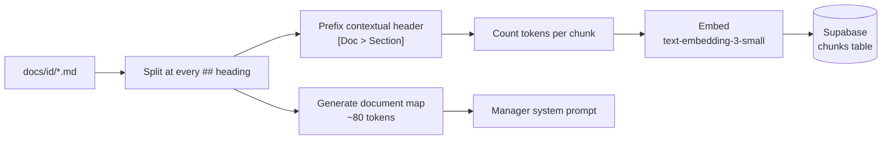
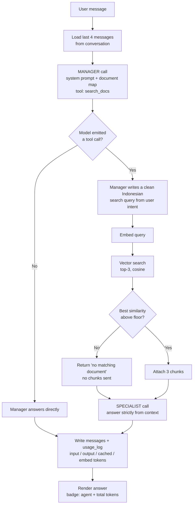
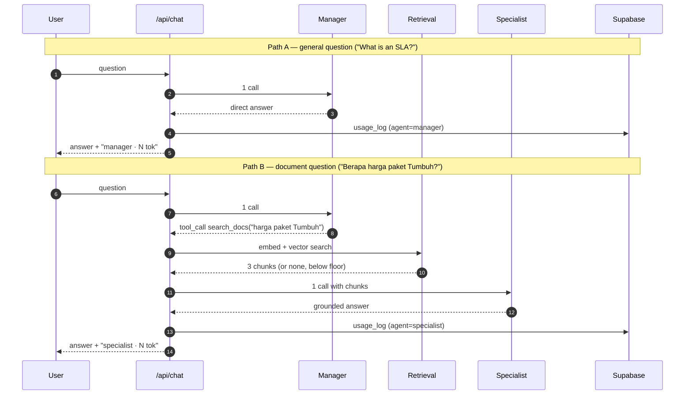

# Architecture — Sigap Assistant

Two-agent chat over a small document corpus. Single chat column for the user;
a `manager` agent answers general questions directly and delegates
document-grounded questions to a `specialist` agent.

Design goal, in priority order:

1. Correct answers, including a clean "not in the documents" response.
2. Minimum tokens per question.
3. Every number visible in the UI and stored in the database.

---

## 1. Repository structure

```
sigap-assistant/
├── app/
│   ├── page.tsx                  # chat UI (single column)
│   ├── history/page.tsx          # per-question token history
│   └── api/chat/route.ts         # orchestrator: manager -> specialist
├── lib/
│   ├── llm.ts                    # provider-agnostic client (OpenAI-compatible)
│   ├── agents/
│   │   ├── manager.ts            # system prompt + tool definition
│   │   └── specialist.ts         # system prompt + answer from context
│   ├── retrieval.ts              # embed query, vector search, similarity floor
│   ├── history.ts                # trim conversation history
│   ├── usage.ts                  # token accounting + DB write
│   └── db.ts                     # Supabase client
├── docs/
│   ├── id/                       # PRODUCTION corpus (Indonesian)
│   │   ├── product.md
│   │   ├── pricing.md
│   │   ├── employee-policy.md
│   │   └── runbook.md
│   ├── en/                       # optional, experiment only
│   └── _gaps.md                  # topics deliberately absent (test material)
├── eval/
│   └── golden.jsonl              # 14 test questions + expected route/chunks
├── scripts/
│   ├── seed.ts                   # chunk -> embed -> store
│   └── eval.ts                   # run golden set, print token table
├── supabase/
│   └── schema.sql
├── ARCHITECTURE.md
├── NOTES.md                      # the one-page write-up
└── scratch.md                    # rough notes during the build (not shipped)
```

---

## 2. Build-time flow (runs once, offline)



No overlap between chunks. Section boundaries are authored by hand, so there is
no boundary uncertainty to pad against, and overlap would duplicate tokens on
every retrieval.

No ANN index. At ~30 rows a sequential scan is instant, and `ivfflat` needs far
more rows before its lists are meaningful.

---

## 3. Runtime flow (every user message)



### Why routing lives inside the manager call

A separate classification call would make every trivial question pay twice. Here
the routing decision *is* the manager's normal turn: it either produces an
answer or a `search_docs` tool call. Routing costs nothing extra.

The same call also rewrites the user's question into a clean search query. The
user may be vague, use pronouns, or mix languages; the manager normalises it
before retrieval ever runs.

### The routing rule

The manager's system prompt carries a compact map of what the documents cover,
plus one rule:

> Call `search_docs` only if answering requires a fact about Sigap (product,
> pricing, internal policy, operations). Otherwise answer directly and briefly.

When uncertain, bias toward the specialist. Over-routing costs tokens;
under-routing invents company facts. The similarity floor makes over-routing
cheap: if nothing matches, no chunks are sent.

---

## 4. Two paths, two costs



---

## 5. Data model

```sql
create extension if not exists vector;

create table chunks (
  id           text primary key,          -- e.g. 'pricing#tumbuh-plan'
  lang         text not null default 'id',
  doc          text not null,
  section      text not null,
  content      text not null,             -- includes the contextual header
  token_count  int  not null,
  embedding    vector(1536)
);

create table conversations (
  id         uuid primary key default gen_random_uuid(),
  created_at timestamptz not null default now()
);

create table messages (
  id              bigserial primary key,
  conversation_id uuid not null references conversations(id),
  role            text not null,          -- 'user' | 'assistant'
  content         text not null,
  created_at      timestamptz not null default now()
);

create table usage_log (
  id             bigserial primary key,
  message_id     bigint not null references messages(id),
  agent          text   not null,         -- 'manager' | 'specialist'
  model          text   not null,
  input_tokens   int    not null,
  output_tokens  int    not null,
  cached_tokens  int    not null default 0,
  embed_tokens   int    not null default 0,
  retrieved_ids  text[],
  top_similarity real,
  routed         boolean not null,        -- did the manager delegate?
  latency_ms     int,
  created_at     timestamptz not null default now()
);
```

`usage_log` is one row per **agent call**, not per message. A specialist answer
produces two rows (manager turn + specialist turn); the UI badge shows their sum.
This keeps the delegation overhead visible instead of hiding it inside a total.

Embedding tokens are logged in their own column rather than folded into the
input count. They are small (~15 per retrieval), but hiding them would make the
headline numbers less trustworthy, not more.

---

## 6. Token strategy

| Lever | Effect |
|---|---|
| Routing via tool call | general questions pay 1 call instead of 2 |
| Top-3 retrieval | sends ~600 tokens of context instead of the whole corpus |
| Similarity floor | out-of-scope questions send 0 chunks |
| History trimmed to 4 messages | bounded growth over a long conversation |
| Prompt caching | system prompt and document map are re-read cheaply |
| Small model for both agents | the specialist's job is extraction, not reasoning |
| Bounded `max_tokens` + "answer briefly" | caps output, the most expensive tokens |

Numbers for each lever are measured against a fixed golden set and reported in
`NOTES.md`.

---

## 7. Evaluation

`eval/golden.jsonl`, 14 questions in three categories:

| Category | Count | Expected route |
|---|---|---|
| General knowledge | 4 | manager |
| Requires documents | 6 | specialist |
| Absent from documents | 3 | specialist, then "not found" |
| (of the above, in Indonesian) | 2 | per category |

Each row records the expected route, the expected chunk ids, and substring
assertions on the answer. That gives three levels of measurement:

- **routing accuracy** — did the manager decide correctly?
- **recall@3 / precision@3** — did retrieval surface the right chunk?
- **answer assertions** — did the required fact appear?

Grading uses substring assertions rather than an LLM judge. Facts in this corpus
are numbers and names, so assertions are sufficient — and spending tokens to
grade a token-efficiency exercise would be self-defeating.

The measured baseline is a deliberately naive v0 (whole corpus stuffed into
every request, full history, no retrieval). Every optimisation is applied one at
a time and re-evaluated, so a regression can be attributed to the change that
caused it.
